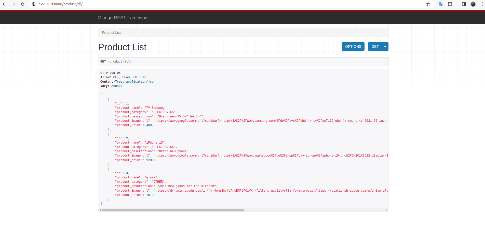
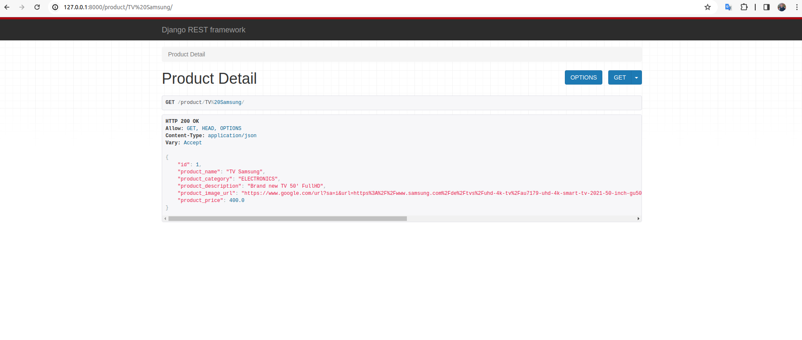
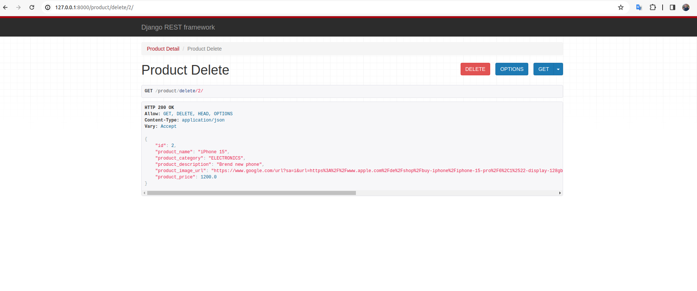
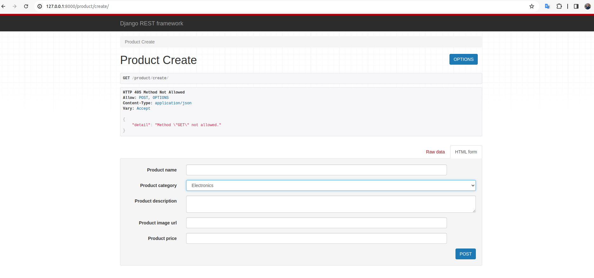
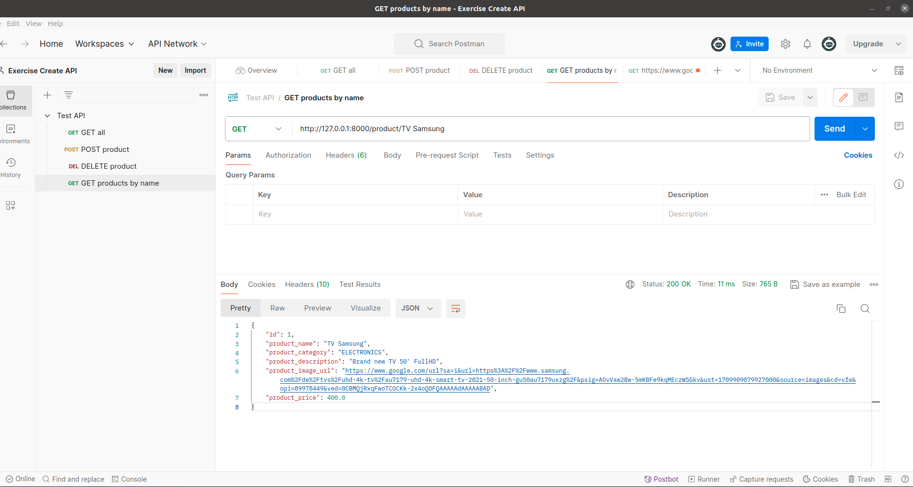

# creating_api_using_django

## I did the exercise following these steps:  
  
### 0. Created a new Django REST app called Product

### 1. Created a new model named **Product**, which has the following data fields:

- product_name 
- product_category
- product_description 
- product_image_url 
- product_price 

### 2. Added a ModelSerializer for the Product model

### 3. Added the views to product/ GET and POST:

- GET all products
- GET products by name
- POST new products
- DELETE products 

### 4. Processed urls

## How it looks like:  
### List product  
  

## Get product by name  
  

## Delete product  
  

## Create product  
  

    
### 6. Tested the API in Postman  

